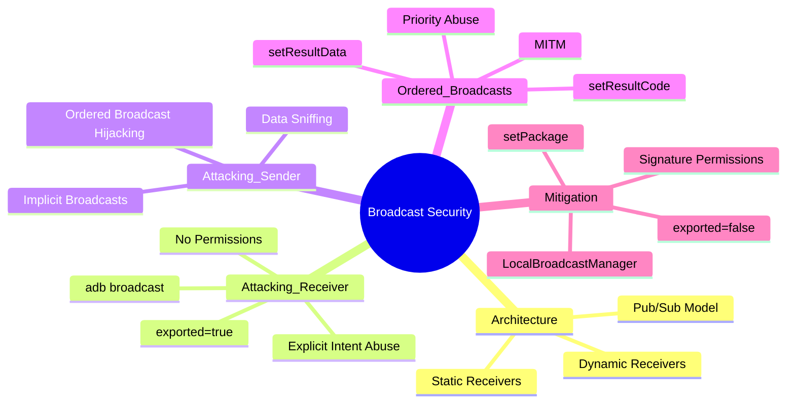

## From “Hello World” to Broadcast Hijacking

In the world of Android security, Broadcast Receivers are often the silent vectors for critical vulnerabilities. They aren't visual like Activities, which makes them easy to overlook, but they are the glue that holds the Android system events together.

In this guide, we will dissect the architecture of Broadcasts, explore how to attack them (Sending & Sniffing), and dive into advanced exploitation techniques like hijacking Ordered Broadcasts.

***

## 1. The Architecture: The Airport Loudspeaker

To understand Broadcasts, you must understand the **Pub/Sub (Publish/Subscribe)** pattern.

### Communication Models

- **Activities (1-to-1)**  
  Like a phone call. You dial a specific number to talk to a specific person. It’s synchronous and usually involves UI.

- **Broadcasts (1-to-Many)**  
  Like an airport loudspeaker. The system announces *“Battery Low”* or *“Boot Completed”*. It doesn't care who listens. Apps that are *subscribed* (registered) will wake up and react.

### The Two Types of Listeners

- **Static (Manifest-declared)**  
  Defined in `AndroidManifest.xml`. These persist even if the app is closed. They are the *Always Listening* ears.

- **Dynamic (Context-registered)**  
  Defined in Java/Kotlin code using `registerReceiver()`. They only live as long as the app (or Activity) is alive.

***

## 2. Attack Vector A: The Uninvited Guest (Sending)

### The Scenario

An app has a Receiver that performs a sensitive action (e.g., giving you a flag, transferring money, bypassing a check).

### The Vulnerability

If a receiver in `AndroidManifest.xml` has `android:exported="true"` and no custom permissions, **any app on the device can talk to it**.

```xml
<receiver
    android:name=".sensitive.FlagReceiver"
    android:exported="true"/>
```

### The Exploit

You don't need to be the system to trigger this. You can force-feed this receiver an Intent.

> **Pro Tip:**  
> If the Receiver does not have an `<intent-filter>`, you cannot call it implicitly (by Action).  
> You must use an Explicit Intent targeting its class name directly.

```bash
adb shell am broadcast -n io.target.app/.sensitive.FlagReceiver --es password "secret123"
```

***

## 3. Attack Vector B: Highway Robbery (Sniffing & Hijacking)

### The Scenario

An app sends sensitive data (like a token or a flag) via a Broadcast to its own components.

### The Vulnerability

The app uses an Implicit Broadcast.

```java
new Intent("com.app.FREE_MONEY");
```

### The Exploit

Since the sender shouted into the void, you can register a Receiver in your own malicious app with a matching Intent Filter.

```xml
<receiver android:name=".MyHackerReceiver" android:exported="true">
    <intent-filter android:priority="999">
        <action android:name="com.app.FREE_MONEY" />
    </intent-filter>
</receiver>
```

**Result:**  
Your app receives the data intended for the legitimate app.

***

## 4. Deep Dive: Ordered Broadcasts & MITM

Ordered Broadcasts are delivered one by one, based on `android:priority`.

### The Trap

Developers might:

- Check `isOrderedBroadcast()`
- Trust the final result

### The Exploit

**Bypassing the Check**

```bash
adb shell am broadcast -n ... --ordered
```

**Man-In-The-Middle (MITM)**

With high priority, you can:

- Steal data via `getStringExtra()`
- Modify intent contents
- Falsify results using `setResultCode()` or `setResultData()`

***

## 5. Broadcast Security Mind-Map (Diagram)

The following mind-map represents the complete Android Broadcast attack surface from a pentester’s perspective.
```markdown

```

***

## 6. Visual Summary (Image)

This image provides a high-level visual summary of Broadcast Receiver attack paths and defenses.


***

## 7. Blue Team Corner: Mitigation

How do we fix this?

- **Close the Door**  
  Always set `android:exported="false"` unless absolutely necessary.

- **Go Local**  
  Use `LocalBroadcastManager` for internal communication.

- **Permissions**  
  Use `android:permission` with `protectionLevel="signature"`.

- **Be Explicit**  
  Use `setPackage()` when sending broadcasts.

***

**Happy Hacking!**  
If this guide helped you think like an attacker, share it with your fellow pentesters and help secure the Android ecosystem.
