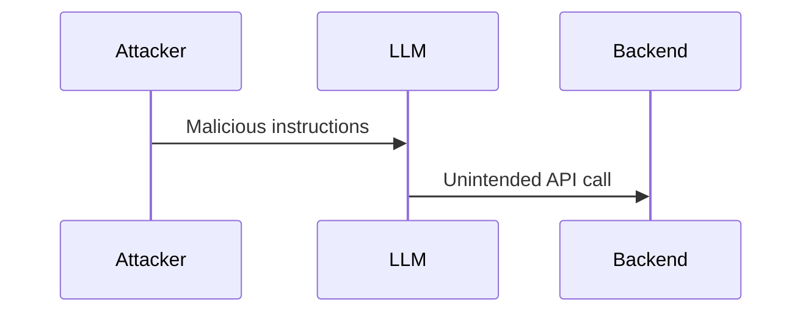
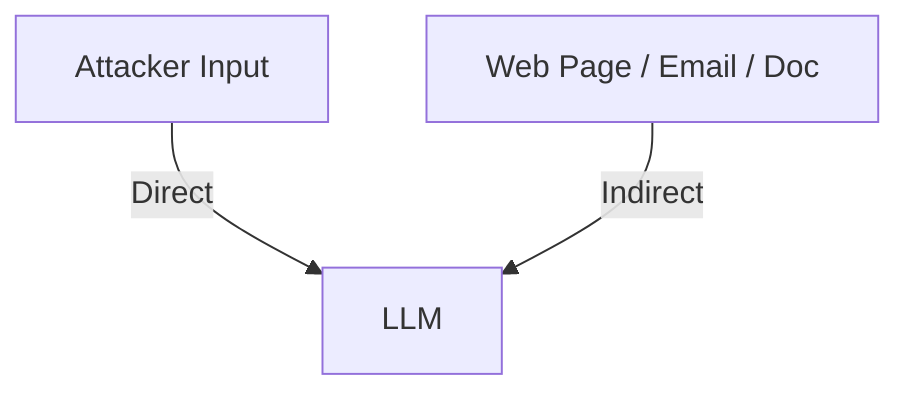
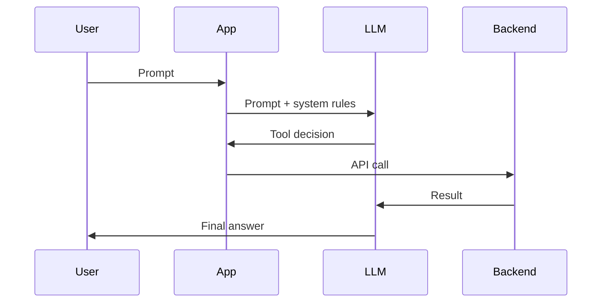
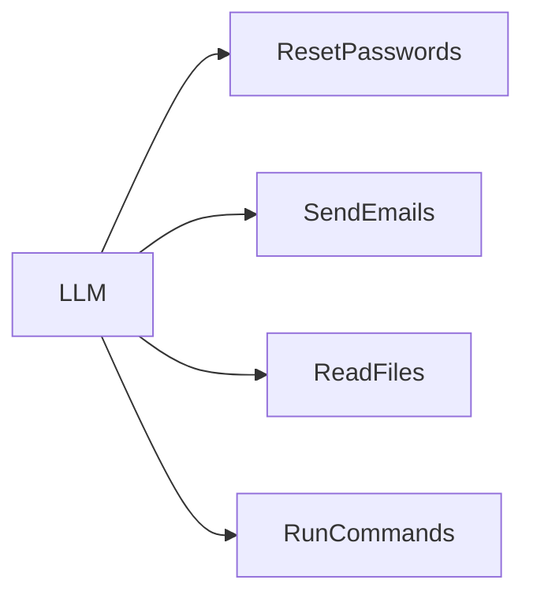
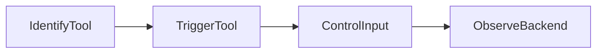
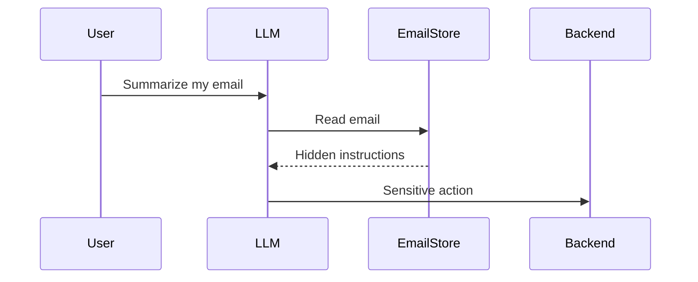
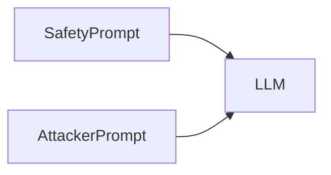
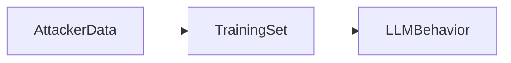
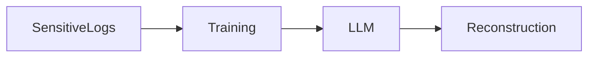
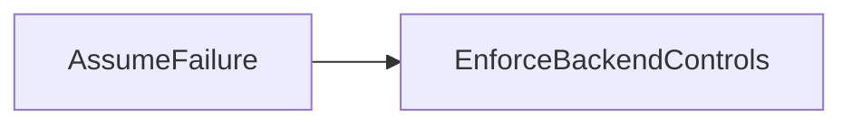

## Why these notes exist

These are **personal review notes** on LLM security from a web exploitation perspective.  
They are intentionally short, high-level, and focused on **how things break**, not on theory.

The goal is simple:  
to quickly refresh the mental model when testing LLM features in labs, bug bounties, or real systems.

Background reference:  
https://portswigger.net/web-security

---

## Big picture: what LLM security really means

Most LLM security problems reduce to three questions:

- What **data** does the model see?
- What **tools / APIs** can it control?
- How much **trust** does the system place in its output?

```mermaid
flowchart LR
    User -->|Text| LLM
    LLM -->|Actions| Backend
    Backend --> Data
````

Key idea:
Once an LLM influences backend behavior, it becomes part of the **attack surface**.

---

## How LLMs behave (security view)

LLMs do not reason or validate intent.
They predict the next token based on patterns.

Security implication:

```mermaid
flowchart LR
    TrustedText --> LLM
    UntrustedText --> LLM
```

There is **no native distinction** between trusted and untrusted input.
Everything is just text.

---

## Prompt injection (core idea)

Prompt injection changes **behavior**, not just output.



Outcomes that matter:

* Unintended actions (API calls, state changes)
* Unintended outputs (secrets, payloads)

---

## Direct vs indirect prompt injection



* **Direct**: attacker types instructions directly
* **Indirect**: attacker hides instructions in content later processed

Indirect injection is harder to detect and often more dangerous.

---

## Typical LLM integration model

Most real systems follow this pattern:



Security takeaway:
If the attacker can steer the model, they may steer backend execution.

---

## Excessive agency

Excessive agency means the LLM can perform **high-impact actions**:



If access control relies on “the model will behave,” the design is already broken.

---

## Mapping attack surface (tester mindset)

First testing step:


If the model can describe its tools, it often generates an attacker’s API map.

---

## LLM-assisted API exploitation pattern

Reusable attack loop:



UI output is secondary.
Backend side effects are what matter.

---

## Indirect prompt injection in practice



The attacker never touches the chat input.

---

## Why naive defenses fail

Prompt-only defenses assume the model enforces rules.



Both are just text.
The model has no hard priority system.

---

## Training data risks

### Poisoning



### Data leakage



Deletion does not guarantee removal from training pipelines.

---

## Defensive mindset

Core principle:



Practical implications:

* Treat LLM-accessible APIs as public
* Enforce auth and authorization server-side
* Limit tool privileges
* Restrict data exposure
* Monitor tool usage

Prompt rules are **not** security controls.

---

## Review checklist

```
□ Do I know every input source (direct and indirect)?
□ Do I know every tool/API the model can call?
□ Are sensitive actions enforced server-side?
□ Can attacker-controlled content influence decisions?
□ Is trust placed in the model instead of the backend?
```

If these are clearly answered, the integration is far more likely to be resilient rather than merely impressive.
